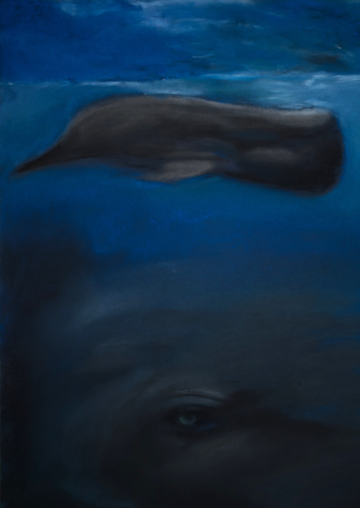

# NightLights

A simple html and AngularJS website for presentation of images or drawings. See demo on http://nightlights.tjingwan.com/.

Note that the LTS of AngularJS ended in december 2021. We will upgrade this repo to Angular, the successor of AngularJS, in the next weeks. 
This security related upgrade of a simple website is intended to be an example for our young developers and public users.  

Also check out:
* https://docs.angularjs.org/misc/version-support-status
* https://blog.angular.io/finding-a-path-forward-with-angularjs-7e186fdd4429
* https://angular.io/

